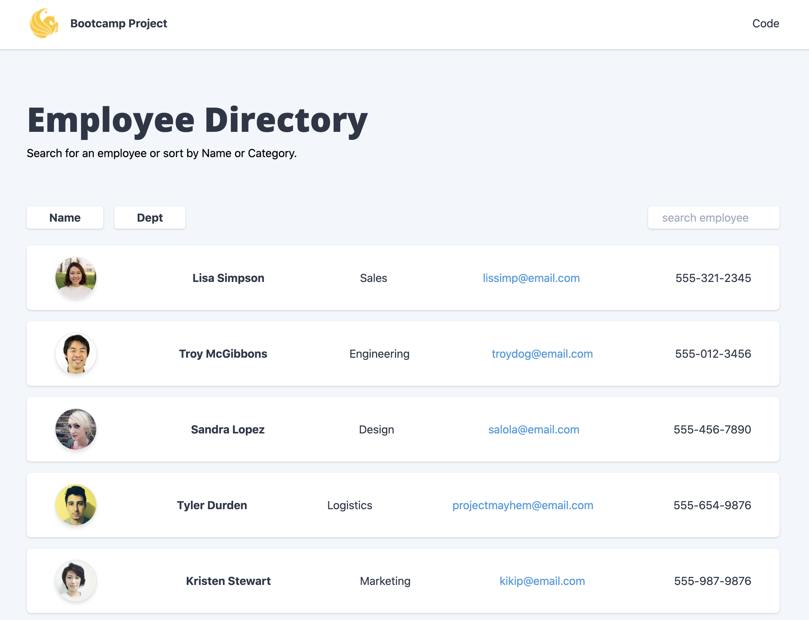

# Employee Directory
 #### [Demo](https://yarocruz.github.io/react-employee-directory/)


## Description

This a [React](https://reactjs.org/) app that lets you view a list of employees, search for a specific employee, 
and sort the employee by either name or department. When you search for an employee it will immediately give you a 
result and clicking on the buttons will sort the employees either in ascending or descending order.
      

## Technologies

Project bootstrapped with [create-react-app](https://reactjs.org/docs/create-a-new-react-app.html#create-react-app). Uses 
[Tailwindcss](https://tailwindcss.com/) for styles. 

## Usage and Installation

Feel free to clone or fork this repo if you find it useful. To install dependencies make sure to run:

```
npm i
```

## Demo

You can see a demo of this app [here](https://yarocruz.github.io/react-employee-directory/)

## Contributing

If you wish to contribute to this project please do a pull request. That be super cool.

## Questions?


Have any questions? Want to collaborate on a project? Shoot me an [email](yarocruz@gmail.com)
